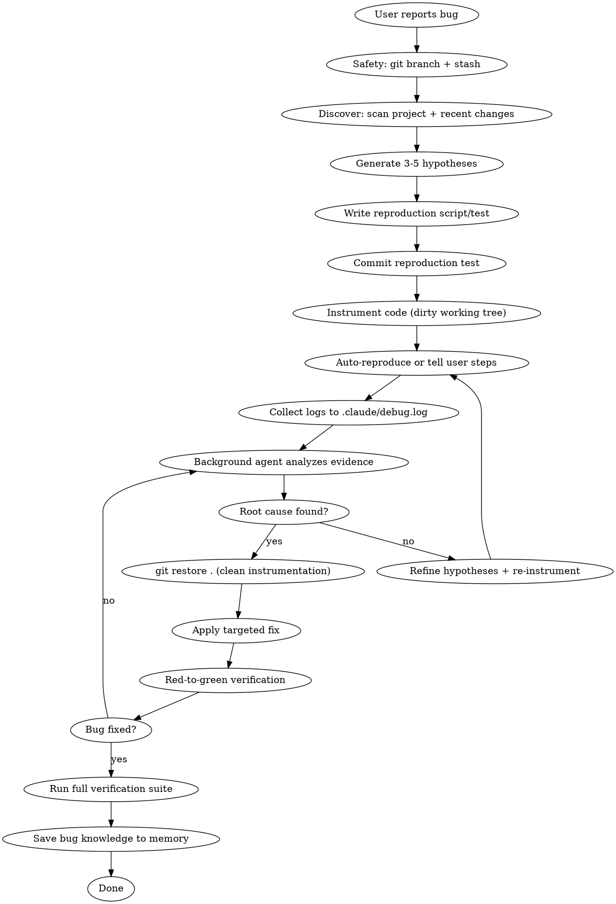

# Debug Mode

Hypothesis-driven debugging with runtime instrumentation, background agent monitoring, git-safe cleanup, and automated regression tests.

## Overview

Instead of guessing at fixes from static code analysis, **Debug Mode** collects runtime evidence first. It instruments code with strategic debug logs, uses background agents to monitor actual execution, proposes targeted fixes based on evidence, writes regression tests, and cleans up all instrumentation after the bug is confirmed fixed.

**Core principle:** Never propose a fix without runtime evidence. Hypothesize -> Instrument -> Observe -> Fix -> Verify -> Clean.

## Five Iron Laws

1. **No fixes without reproduction first** — if you can't reproduce it, you can't prove you fixed it
2. **No guessing** — instrument and observe, never propose fixes from static reading alone
3. **Never hang the terminal** — detach background processes, use timeouts
4. **Protect context window** — logs go to file, then query surgically
5. **Git-safe cleanup** — use `git restore .` after committing reproduction test, never manually delete logs

## Workflow



## Steps

### Phase 0: Safety First

Before touching anything:

1. **Create a debug branch** (if not already on a feature branch):
   ```bash
   git checkout -b debug/<bug-short-name>
   ```
2. **Stash any uncommitted work**:
   ```bash
   git stash push -m "pre-debug stash"
   ```
3. **Scan the project** for infrastructure context:
   - What test framework exists? (`vitest`, `jest`, `playwright`, `pytest`, etc.)
   - What's the dev server command? (`pnpm run dev`, `npm start`, etc.)
   - Recent git changes to affected files: `git log --oneline -15 -- <affected-files>`
   - Check for existing related tests

### Phase 1: Understand the Bug

- Read the user's bug description carefully
- Identify the affected files, routes, components, or services
- Read all relevant source code before forming any opinion
- Trace the call chain — follow data flow from entry point to where the bug manifests
- Check for recent changes: `git log --oneline -10 -- <affected-files>`

### Phase 2: Generate Hypotheses

Form **3-5 ranked hypotheses** about what could cause the bug. Include non-obvious possibilities.

Format each hypothesis with evidence criteria:

```
HYPOTHESIS 1 (HIGH): [Short title]
Why: [Reasoning based on code reading]
Evidence to CONFIRM: [What runtime data would prove this]
Evidence to DENY: [What runtime data would disprove this]
Test: [What debug log would confirm/deny this]
Location: [File:line where to instrument]

HYPOTHESIS 2 (MEDIUM): [Short title]
...
```

**Ranking rules:**
- **HIGH** — Code path analysis strongly suggests this
- **MEDIUM** — Plausible but needs runtime evidence
- **LOW** — Non-obvious but worth ruling out

Present hypotheses to the user before instrumenting.

### Phase 3: Write Reproduction Script

Before adding any debug logs, write a **reproduction test or script** that triggers the bug.

**Reproduction strategy (pick best fit):**

| Bug Type | Best Strategy | Example |
|----------|---------------|---------|
| Logic error | Failing unit test | `vitest` test case that asserts wrong output |
| API response | curl / HTTP request | `curl -X POST localhost:3000/api/...` |
| Race condition | Loop 50x in script | Script that hammers endpoint repeatedly |
| UI/state bug | Playwright e2e test | Navigate + click + assert |
| State corruption | Standalone repro script | Script that reproduces the state |
| Flaky test | Loop 50x | Run test in loop to catch intermittent fail |
| CORS/headers | curl -v | Verbose HTTP inspection |

**Commit the reproduction test immediately:**
```bash
git add <repro-test-file>
git commit -m "test: add reproduction for <bug-description>"
```

This is critical — the reproduction test is committed BEFORE instrumentation, enabling git-safe cleanup later.

### Phase 4: Instrument Code with Debug Logs

Now add **structured, tagged debug logs** to the working tree (dirty state).

**Log format standard — use stderr to avoid contaminating app output:**

```typescript
// TypeScript / Next.js — use console.error for stderr
// #region DEBUG
console.error('[DEBUG-MODE][H1:auth-check][validateUser]', JSON.stringify({
  userId, isAuthenticated, sessionExpiry: session?.expires,
  timestamp: new Date().toISOString()
}));
// #endregion DEBUG
```

```python
# Python
# #region DEBUG
import json, sys, datetime
print(f"[DEBUG-MODE][H1:auth-check][validate_user] {json.dumps({'user_id': user_id, 'is_authenticated': is_authenticated, 'timestamp': datetime.datetime.now().isoformat()})}", file=sys.stderr)
# #endregion DEBUG
```

```go
// Go
// #region DEBUG
fmt.Fprintf(os.Stderr, "[DEBUG-MODE][H1:auth-check][ValidateUser] userId=%s isAuth=%v timestamp=%s\n",
    userId, isAuthenticated, time.Now().Format(time.RFC3339))
// #endregion DEBUG
```

**Log tag anatomy:**
```
[DEBUG-MODE][H<N>:<hypothesis-slug>][<function-name>] key=value ...
```
- `[DEBUG-MODE]` — universal prefix for bulletproof grep cleanup
- `[H<N>:<slug>]` — maps to hypothesis, enables filtering: `grep '\[H1'`
- `[<function>]` — where in the code
- `key=value` — structured data capture

**Instrumentation rules:**
- Wrap ALL debug code in `// #region DEBUG` / `// #endregion DEBUG` markers
- Tag every log with its hypothesis ID (`H1`, `H2`, `H3`)
- Use `console.error` / `stderr` — never `console.log` / `stdout` (avoids polluting app output)
- Log at entry/exit points of suspected functions
- Capture variable states, not just "reached here"
- Add logs at branching points (if/else, switch, error handlers)
- Keep logs focused — 3-5 strategic points per hypothesis, not 20+ scattered
- **Never instrument production-only code paths without user awareness**

### Phase 5: Reproduce and Collect Evidence

**Option A: Auto-reproduce (preferred)**

If tests or reproduction scripts exist, use a background agent to run them and collect logs:

```bash
# Redirect all output to .claude/debug.log
mkdir -p .claude
node repro-script.js > .claude/debug.log 2>&1

# Or for test-based reproduction
pnpm run test:run 2>&1 | tee .claude/debug.log

# Or for dev server bugs — detach the server first
nohup pnpm run dev > .claude/debug-server.log 2>&1 &
SERVER_PID=$!
sleep 5
# Run reproduction steps...
curl -s http://localhost:3000/api/affected-route >> .claude/debug.log 2>&1
kill $SERVER_PID
```

**CRITICAL: Always detach long-running processes** — never let `pnpm run dev` block the terminal:
```bash
nohup <command> > .claude/debug-server.log 2>&1 &
SERVER_PID=$!
sleep 3  # Wait for startup
# ... do work ...
kill $SERVER_PID  # Always clean up
```

**Option B: User-assisted reproduction**

When auto-reproduce isn't possible (UI bugs, browser-specific issues), give the user **explicit, numbered steps**:

```
To test this, please:
1. Restart the dev server (Ctrl+C then `pnpm run dev`)
2. Hard refresh the browser (Cmd+Shift+R / Ctrl+Shift+R)
3. Clear browser cache if needed (DevTools → Application → Clear Storage)
4. Navigate to [specific page/route]
5. Do [specific action that triggers the bug]
6. Check the TERMINAL (not browser console) for lines starting with [DEBUG-MODE]
7. Copy-paste the terminal output back to me, OR I'll read it from .claude/debug.log

Expected: You should see debug output with hypothesis tags like [H1], [H2].
If the bug reproduces, I'll have the runtime evidence I need.
```

**Always specify:**
- Whether to restart the server (usually yes)
- Whether to hard refresh the browser
- Whether to clear cache/cookies/localStorage
- The exact user actions to perform
- Where to look for output (terminal vs browser console)
- Whether user needs to copy/paste output or agent reads from file

### Phase 6: Background Agent Analysis

Launch a background agent to analyze collected evidence:

**Background agent prompt template:**

```
You are analyzing debug output for a debugging session.

Bug description: [bug description]

Hypotheses being tested:
- H1 (HIGH): [description] — Evidence to confirm: [criteria]
- H2 (MEDIUM): [description] — Evidence to confirm: [criteria]
- H3 (LOW): [description] — Evidence to confirm: [criteria]

Instructions:
1. Read .claude/debug.log (or .claude/debug-server.log)
2. Extract all lines containing [DEBUG-MODE]
3. For each hypothesis, classify as:
   - CONFIRMED: Evidence directly supports this as root cause
   - DENIED: Evidence contradicts this hypothesis
   - INCONCLUSIVE: Not enough data, need more instrumentation
4. For CONFIRMED hypotheses, extract the specific data that proves it
5. For DENIED hypotheses, explain what the data showed instead
6. Flag any UNEXPECTED errors, stack traces, or anomalies not covered by hypotheses
7. Suggest what additional instrumentation would help for INCONCLUSIVE hypotheses

Query log surgically to protect context window:
- grep '[DEBUG-MODE]' .claude/debug.log
- grep '[H1' .claude/debug.log
- grep -C 2 'Exception\|Error\|FATAL' .claude/debug.log | head -n 50

Do NOT attempt fixes. Only collect, analyze, and report evidence.
```

**If evidence is INCONCLUSIVE for all hypotheses:**
1. Generate new hypotheses based on what the data DID reveal
2. Add more targeted instrumentation
3. Repeat from Phase 5

### Phase 7: Git-Safe Cleanup + Fix

This is the key innovation — **commit-then-instrument pattern**:

1. **Clean all instrumentation with git restore** (since reproduction test was already committed):
   ```bash
   git restore .
   ```
   This perfectly removes ALL debug logs without risk of syntax corruption. No manual deletion needed.

2. **Verify clean state:**
   ```bash
   grep -r "\[DEBUG-MODE\]" . --include="*.ts" --include="*.tsx" --include="*.js" --include="*.jsx" --include="*.py" --include="*.go" --include="*.rb" --include="*.php"
   # Should return nothing
   ```

3. **Apply the targeted fix** — should be minimal (often 2-5 lines):
   - Fix the root cause, not the symptom
   - If fix touches more than 10-15 lines, pause and verify you're addressing root cause

4. **Commit the fix separately:**
   ```bash
   git add <fixed-files>
   git commit -m "fix(<scope>): <description of root cause fix>"
   ```

### Phase 8: Red-to-Green Verification

Prove the fix actually works with the committed reproduction test:

1. **GREEN check** — Run reproduction test, should PASS now:
   ```bash
   pnpm run test:run -- <repro-test-file>
   ```

2. **RED check** (optional but gold standard) — Temporarily revert fix, reproduction should FAIL:
   ```bash
   git stash push -m "verify-red"
   pnpm run test:run -- <repro-test-file>  # Should FAIL
   git stash pop                             # Restore fix
   ```

3. **Full verification suite** — run whatever checks the project uses:
   ```bash
   # Detect and run the project's standard checks. Examples:
   # TypeScript:  npx tsc --noEmit
   # Build:       npm run build / pnpm run build / yarn build
   # Lint:        npm run lint / pnpm run lint
   # Tests:       npm test / pnpm run test / pytest / go test ./...
   # Run ALL checks that CI would run — check the CI config if unsure
   ```

4. **Ask user to manually verify** (for UI/UX bugs):
   ```
   Fix applied and tests pass. To verify manually:
   1. Restart the dev server
   2. Hard refresh the browser
   3. [Repeat the exact reproduction steps]
   4. Expected behavior: [describe what should happen now]

   Let me know if the fix works or if the issue persists.
   ```

### Phase 9: Document and Close

Once the user confirms the fix works:

1. **Clean up debug artifacts:**
   ```bash
   rm -f .claude/debug.log .claude/debug-server.log
   ```

2. **Save bug knowledge to memory** — write a memory file:
   ```markdown
   ---
   name: bug-<short-description>
   description: <one-line summary of the bug and fix>
   type: project
   ---

   Bug: <what the bug was>
   Root cause: <what actually caused it>
   Fix: <what was changed and why>
   Prevention: <what to watch for in future>
   **Why:** <why the root cause existed — design flaw, missing validation, race condition, etc.>
   **How to apply:** <when to think about this in future work>
   ```

3. **Merge debug branch** (if created in Phase 0):
   ```bash
   git checkout <original-branch>
   git merge debug/<bug-short-name>
   git branch -d debug/<bug-short-name>
   ```

4. **Restore stashed work** (if stashed in Phase 0):
   ```bash
   git stash pop
   ```

## Automatic Reproduction Strategies

**Priority order — always try automation before asking user:**

| Priority | Strategy | When to Use | Example |
|----------|----------|-------------|---------|
| 1 | Standalone script | Fastest, bypasses framework config | `node repro.js` |
| 2 | Failing unit test | Gold standard when test framework accessible | `vitest` test case |
| 3 | curl / HTTP request | API bugs | `curl -X POST localhost:3000/api/...` |
| 4 | Playwright e2e test | UI bugs that can be automated | `pnpm run test:e2e` |
| 5 | Loop 50x | Race conditions, flaky bugs | Script that runs 50 iterations |
| 6 | Manual user steps | Last resort — complex UI interactions | Numbered instructions |

## Context Window Protection

**Never dump raw logs into conversation.** Always query surgically:

```bash
# Only debug-mode lines
grep '[DEBUG-MODE]' .claude/debug.log

# Filter by hypothesis
grep '\[H1' .claude/debug.log
grep '\[H2' .claude/debug.log

# Find errors with context
grep -C 2 'Exception\|Error\|FATAL' .claude/debug.log | head -n 50

# Count occurrences (is a code path even reached?)
grep -c '\[H3:cache-miss\]' .claude/debug.log

# Tail for most recent entries
tail -n 30 .claude/debug.log
```

## Iteration Limits

| Attempt | Action |
|---------|--------|
| 1-2 | Normal hypothesis -> instrument -> analyze -> fix cycle |
| 3 | Step back, re-read broader context, consider architectural causes, expand hypothesis scope |
| 4 | Escalate to user with full findings: hypotheses tested, evidence collected, what's still unknown |

**Never loop more than 4 times** without user input.

## Red Flags — You're Doing It Wrong

| Symptom | Problem |
|---------|---------|
| Proposing a fix without debug data | Guessing, not debugging. Instrument first. |
| Adding 20+ debug logs at once | Too broad. Focus on 3-5 strategic points per hypothesis. |
| Using `console.log` instead of `console.error` | Pollutes app stdout. Always use stderr. |
| Fix is 50+ lines | Probably treating a symptom. Re-analyze root cause. |
| Manually deleting debug logs line by line | Use `git restore .` — that's why we commit repro test first. |
| Skipping user verification | The user must confirm. No assumptions. |
| Dumping full log file into conversation | Context window pollution. Query with grep. |
| Running `pnpm run dev` without detaching | Will hang terminal. Always use `nohup ... &`. |
| No reproduction test committed | You lose git-safe cleanup. Always write and commit repro first. |
| Skipping the RED check | You can't prove your fix works without proving it fails without the fix. |

## Language-Specific Debug Patterns

| Language | stderr Command | Region Markers |
|----------|---------------|----------------|
| TypeScript/JS | `console.error('[DEBUG-MODE]...')` | `// #region DEBUG` / `// #endregion DEBUG` |
| Python | `print('...', file=sys.stderr)` | `# #region DEBUG` / `# #endregion DEBUG` |
| Go | `fmt.Fprintf(os.Stderr, "...")` | `// #region DEBUG` / `// #endregion DEBUG` |
| Ruby | `$stderr.puts "[DEBUG-MODE]..."` | `# #region DEBUG` / `# #endregion DEBUG` |
| PHP | `error_log("[DEBUG-MODE]...")` | `// #region DEBUG` / `// #endregion DEBUG` |

## Quick Reference

| Phase | Key Action | Tool |
|-------|-----------|------|
| 0. Safety | Git branch + stash | Bash (git) |
| 1. Understand | Read code + git history | Read, Bash (git log) |
| 2. Hypothesize | Form 3-5 ranked theories | Present to user |
| 3. Reproduce | Write + commit reproduction test | Write/Edit, Bash (git commit) |
| 4. Instrument | Add tagged debug logs (dirty tree) | Edit tool |
| 5. Collect | Auto-run or user-assisted, logs to file | Bash (background), Agent (background) |
| 6. Analyze | Background agent parses evidence | Agent tool (background) |
| 7. Clean + Fix | `git restore .` then apply fix | Bash (git restore), Edit tool |
| 8. Verify | Red-to-green + full suite | Bash (test commands) |
| 9. Document | Memory file + merge branch + cleanup | Write to memory, Bash (git) |
