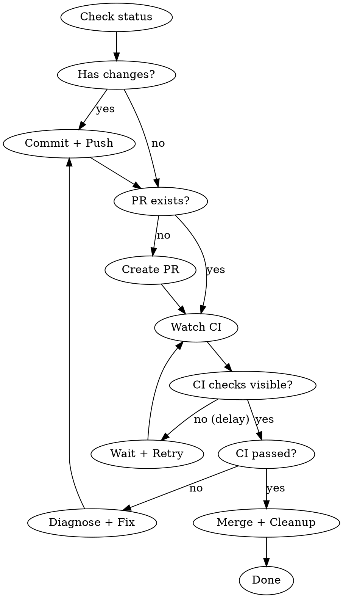

# Ship It

Commit, push, create PR, watch CI, auto-fix failures, merge, and return to main.

## Workflow

## Steps

### 1. Commit & Push
- If working tree has changes: stage, commit with descriptive message, push
- If clean but not pushed: push
- If already pushed: skip to PR

### 2. Create PR (if none exists)
- Check with `gh pr list --head <branch>`
- If no PR: `gh pr create` with summary of all commits since main
- If PR exists: use existing PR number

### 3. Watch CI (CRITICAL — never skip this)

CI checks may take time to appear after push/PR creation. You MUST confirm checks are visible and passing before merging.

**Step 3a: Wait for checks to appear**
- Run `gh pr checks <pr-number>` to see if checks are listed
- If "no checks reported" is returned, CI has not started yet — this does NOT mean "no errors"
- Wait 15-30 seconds and retry: `gh pr checks <pr-number>`
- Repeat up to 6 times (total ~3 minutes) until checks appear
- If checks never appear after 6 retries, inform the user — do NOT assume it's safe to merge

**Step 3b: Watch checks until completion**
- Once checks are visible, run `gh pr checks <pr-number> --watch` to wait for all checks to finish
- Only proceed to merge when ALL checks show as passed
- If `--watch` exits with code 0, checks passed
- If `--watch` exits with non-zero, checks failed — go to step 4

**NEVER merge when:**
- `gh pr checks` returns "no checks reported" — checks haven't loaded yet
- Any check is still "pending" or "in_progress"
- Any check has failed

### 4. On CI Failure
- Run `gh pr checks <pr-number>` to identify which check failed
- Fetch the failed check's logs: `gh run view <run-id> --log-failed`
- Diagnose the error (lint, type-check, test failure, build error)
- Fix the issue in code
- Commit the fix, push, and go back to step 3 (watch CI again)
- Repeat until CI passes (max 3 fix attempts, then ask user)

### 5. On CI Pass — Merge & Cleanup
- Only after ALL checks are confirmed green
- Squash merge: `gh pr merge <pr-number> --squash --delete-branch`
- If branch protection blocks merge, use `--admin` flag
- Checkout main: `git checkout main && git pull`
- Confirm completion

## Important
- Always use `--squash` merge to keep main history clean
- **NEVER merge without confirmed green CI** — "no checks" means "not loaded yet", not "no errors"
- Max 3 auto-fix attempts before asking the user for help
- Never force push or use destructive git commands
- Follow the project's existing commit message conventions
